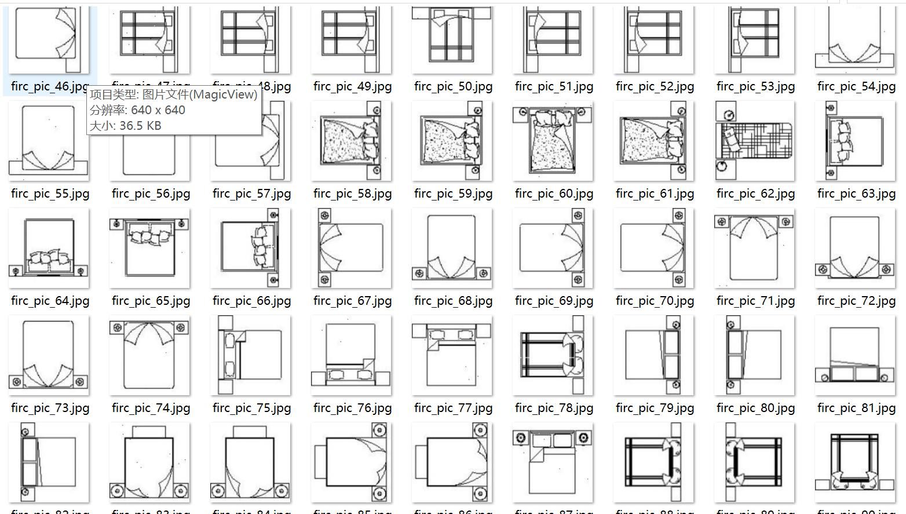
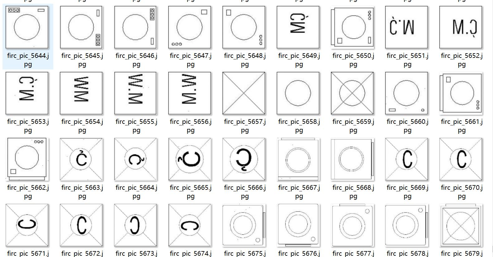
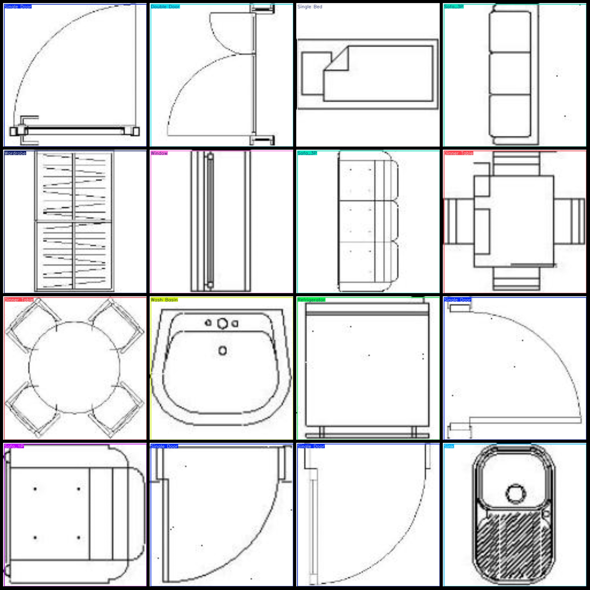
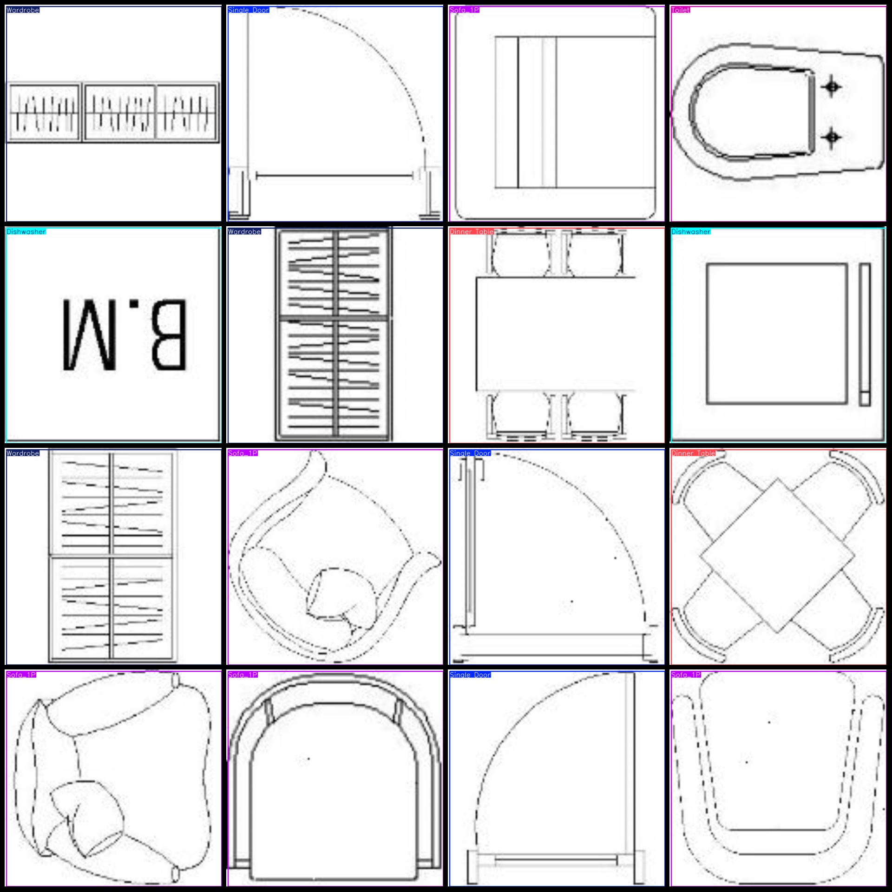

# Dataset of indoor furniture and facilities detection in planar images with VOC+YOLO format, 6081 images in 24 categories

Special attention should be paid to the dataset, which is enclosed within the entire graph. See the example annotations for details.

Dataset format: Pascal VOC format + YOLO format (txt file without split path, only contains jpg images and corresponding VOC format xml files and yolo format txt files).

Number of images (number of jpg files): 6081.

Number of XML files: 6081.

Number of txt files: 6081.

Label count: 24.

["Corner Sofa", "Dinner Table", "Dishwasher", "Door Window", "Double Bed", "Double Door", "Oven Stove", "Refrigerator", "Shower", "Single Bed", "Single Door", "Sink", "Sofa_1P", "Sofa_2P", "Sofa_3P", "Stairs", "Study Table", "Television", "Toilet", "Wardrobe", "Wash Basin", "Washbasin Cabinet", "Washing Machine", "Window"]

The number of boxes labeled in each category:

- Corner Sofa frame count = 102, occupying images count = 102.
- Dinner Table frame count = 636, occupying images count = 636.
- Dishwasher frame count = 171, occupying images count = 171.
- Door Window frame count = 114, occupying images count = 114.
- Double Bed frame count = 387, occupying images count = 387.
- Double Door frame count = 234, occupying images count = 234.
- Oven Stove frame count = 216, occupying images count = 216.
- Refrigerator frame count = 114, occupying images count = 114.
- Shower frame count = 358, occupying images count = 358.
- Single Bed frame count = 270, occupying images count = 270.
- Single Door frame count = 416, occupying images count = 416.
- Sink frame count = 225, occupying images count = 225.
- Sofa_1P frame count = 311, occupying images count = 311.
- Sofa_2P frame count = 212, occupying images count = 212.
- Sofa_3P frame count = 252, occupying images count = 252.
- Stairs Frame Count = 10, Image Count = 10.
- Study Table Frame Count = 180, Image Count = 180.
- Television Frame Count = 78, Image Count = 78.
- Toilet Frame Count = 401, Image Count = 401.
- Wardrobe Frame Count = 322, Image Count = 322.
- Wash Basin Frame Count = 377, Image Count = 377.
- Washbasin Cabinet Frame Count = 216, Image Count = 216.
- Washing Machine Frame Count = 173, Image Count = 173.
- Window Frame Count = 306, Image Count = 306.

The total number of frames is 6081.

Image resolution: 640x640.

Use the labeling tool: labelImg.

Annotation rules: Draw a rectangle around the category.

Important Notice: The dataset is not divided into training, validation, and testing sets. Please divide it yourself.

Special Disclaimer: This dataset does not guarantee the accuracy of the trained model or the weight files.

Preview of the image:
## Images

Here is a pay link on Stripe ( https://buy.stripe.com/3cs8yP7sY87d0vu9AB ). Please contact me lonlonago@foxmail.com after funding $89, and I will send you a complete data files , thank you!

